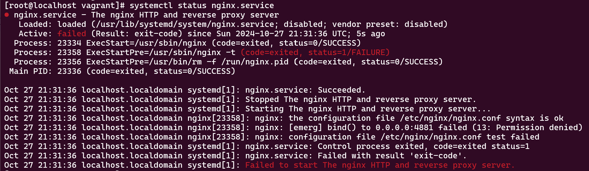
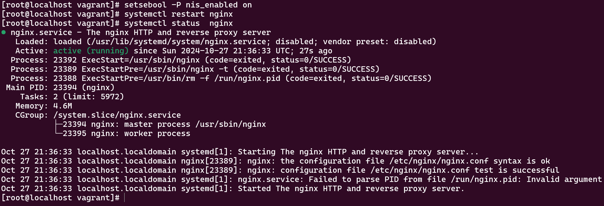

# Домашнее задание
## 1. Запустить nginx на нестандартном порту 3-мя разными способами:
* переключатели setsebool;
* добавление нестандартного порта в имеющийся тип;
* формирование и установка модуля SELinux.

## 2. Обеспечить работоспособность приложения при включенном selinux.
* развернуть приложенный стенд https://github.com/mbfx/otus-linux-adm/tree/master/selinux_dns_problems;
* выяснить причину неработоспособности механизма обновления зоны (см. README);
* предложить решение (или решения) для данной проблемы;
* выбрать одно из решений для реализации, предварительно обосновав выбор;
* реализовать выбранное решение и продемонстрировать его работоспособность.

# Решение

## 1. Запустить nginx на нестандартном порту 3-мя разными способами:

1) Был немного изменен Vagrant File 
 - за основу был взят образ centos
 - использован пакетный менеджер dnf
 - добавлен policycoreutils-python-utils

2) Первый способ запуска на другом порту сразу указан в [Vagrantfile](Vagrantfile)

После создания вирутального сервера проверяем доступность на порту:

```
[root@localhost vagrant]# curl 127.0.0.1:4881 -vv
* Rebuilt URL to: 127.0.0.1:4881/
*   Trying 127.0.0.1...
* TCP_NODELAY set
* Connected to 127.0.0.1 (127.0.0.1) port 4881 (#0)
> GET / HTTP/1.1
> Host: 127.0.0.1:4881
> User-Agent: curl/7.61.1
> Accept: */*
>
< HTTP/1.1 200 OK
< Server: nginx/1.14.1
< Date: Sun, 27 Oct 2024 21:21:46 GMT
< Content-Type: text/html
< Content-Length: 4057
< Last-Modified: Mon, 07 Oct 2019 21:16:24 GMT
< Connection: keep-alive
< ETag: "5d9bab28-fd9"
< Accept-Ranges: bytes
```

Обращаю внимание, что я сразу выключил SELinux в [Vagrantfile](Vagrantfile) для удобства проверки работоспособности

Поэтому:

```
[root@localhost vagrant]# getenforce
Permissive
```

Проверяем что firewalld выключен

```
[root@localhost vagrant]# systemctl status firewalld
● firewalld.service - firewalld - dynamic firewall daemon
   Loaded: loaded (/usr/lib/systemd/system/firewalld.service; disabled; vendor preset: enabled)
   Active: inactive (dead)
     Docs: man:firewalld(1)
```

Включим SELinux:
```
[root@localhost vagrant]# setenforce 1
[root@localhost vagrant]# getenforce
Enforcing
```

И после этого перезапустим nginx. И он свалится с ошибкой




После, выполним комманды:

```
setsebool -P nis_enabled on
```

Команда setsebool -P nis_enabled on в CentOS и RHEL/OEL  включает опцию SELinux, которая разрешает доступ к NIS (Network Information Service) в SELinux.

setsebool: Это команда для временного или постоянного изменения значений переключателей SELinux.

-P: Флаг, который сохраняет изменения постоянно, чтобы они применялись после перезагрузки системы.

nis_enabled: Это имя переключателя SELinux, который управляет доступом к NIS-серверам.

on: Устанавливает значение переключателя в "включено".


После перезапуска мы получаем успешный запуск NGINX:



На всякий случай:
```
[root@localhost vagrant]# getsebool -a | grep nis_enabled
nis_enabled --> on
```

Выключим, и попробуем добавить Nginx в стандартные типы, в SELinux:

```
[root@localhost vagrant]# semanage port -a -t http_port_t -p tcp 4881
[root@localhost vagrant]# systemctl restart nginx.service
[root@localhost vagrant]# systemctl status  nginx.service
● nginx.service - The nginx HTTP and reverse proxy server
   Loaded: loaded (/usr/lib/systemd/system/nginx.service; disabled; vendor preset: disabled)
   Active: active (running) since Sun 2024-10-27 21:44:30 UTC; 5s ago
  Process: 24120 ExecStart=/usr/sbin/nginx (code=exited, status=0/SUCCESS)
  Process: 24118 ExecStartPre=/usr/sbin/nginx -t (code=exited, status=0/SUCCESS)
  Process: 24116 ExecStartPre=/usr/bin/rm -f /run/nginx.pid (code=exited, status=0/SUCCESS)
 Main PID: 24122 (nginx)
    Tasks: 2 (limit: 5972)
   Memory: 3.9M
   CGroup: /system.slice/nginx.service
           ├─24122 nginx: master process /usr/sbin/nginx
           └─24123 nginx: worker process

Oct 27 21:44:30 localhost.localdomain systemd[1]: nginx.service: Succeeded.
Oct 27 21:44:30 localhost.localdomain systemd[1]: Stopped The nginx HTTP and reverse proxy server.
Oct 27 21:44:30 localhost.localdomain systemd[1]: Starting The nginx HTTP and reverse proxy server...
Oct 27 21:44:30 localhost.localdomain nginx[24118]: nginx: the configuration file /etc/nginx/nginx.conf syntax is ok
Oct 27 21:44:30 localhost.localdomain nginx[24118]: nginx: configuration file /etc/nginx/nginx.conf test is successful
Oct 27 21:44:30 localhost.localdomain systemd[1]: nginx.service: Failed to parse PID from file /run/nginx.pid: Invalid argument
Oct 27 21:44:30 localhost.localdomain systemd[1]: Started The nginx HTTP and reverse proxy server.
[root@localhost vagrant]# semanage port -l | grep http
http_cache_port_t              tcp      8080, 8118, 8123, 10001-10010
http_cache_port_t              udp      3130
http_port_t                    tcp      4881, 80, 81, 443, 488, 8008, 8009, 8443, 9000
pegasus_http_port_t            tcp      5988
pegasus_https_port_t           tcp      5989
```

Все работает. 

Удалим и воспользуемся третим способом - audit2allow 

Соберем модуль на основе логов и включим его. 

```

[root@localhost vagrant]# grep nginx /var/log/audit/audit.log | audit2allow -M nginx
******************** IMPORTANT ***********************
To make this policy package active, execute:

semodule -i nginx.pp

[root@localhost vagrant]# semodule -i nginx.pp


[root@localhost vagrant]# systemctl restart nginx.service

[root@localhost vagrant]# systemctl status nginx.service
● nginx.service - The nginx HTTP and reverse proxy server
   Loaded: loaded (/usr/lib/systemd/system/nginx.service; disabled; vendor preset: disabled)
   Active: active (running) since Sun 2024-10-27 21:49:02 UTC; 14s ago
  Process: 24184 ExecStart=/usr/sbin/nginx (code=exited, status=0/SUCCESS)
  Process: 24182 ExecStartPre=/usr/sbin/nginx -t (code=exited, status=0/SUCCESS)
  Process: 24181 ExecStartPre=/usr/bin/rm -f /run/nginx.pid (code=exited, status=0/SUCCESS)
 Main PID: 24186 (nginx)
    Tasks: 2 (limit: 5972)
   Memory: 5.4M
   CGroup: /system.slice/nginx.service
           ├─24186 nginx: master process /usr/sbin/nginx
           └─24187 nginx: worker process

Oct 27 21:49:01 localhost.localdomain systemd[1]: Starting The nginx HTTP and reverse proxy server...
Oct 27 21:49:02 localhost.localdomain nginx[24182]: nginx: the configuration file /etc/nginx/nginx.conf syntax is ok
Oct 27 21:49:02 localhost.localdomain nginx[24182]: nginx: configuration file /etc/nginx/nginx.conf test is successful
Oct 27 21:49:02 localhost.localdomain systemd[1]: nginx.service: Failed to parse PID from file /run/nginx.pid: Invalid argument
Oct 27 21:49:02 localhost.localdomain systemd[1]: Started The nginx HTTP and reverse proxy server.

```

При использовании модуля, после перезагрузки он так-же останется работать. 