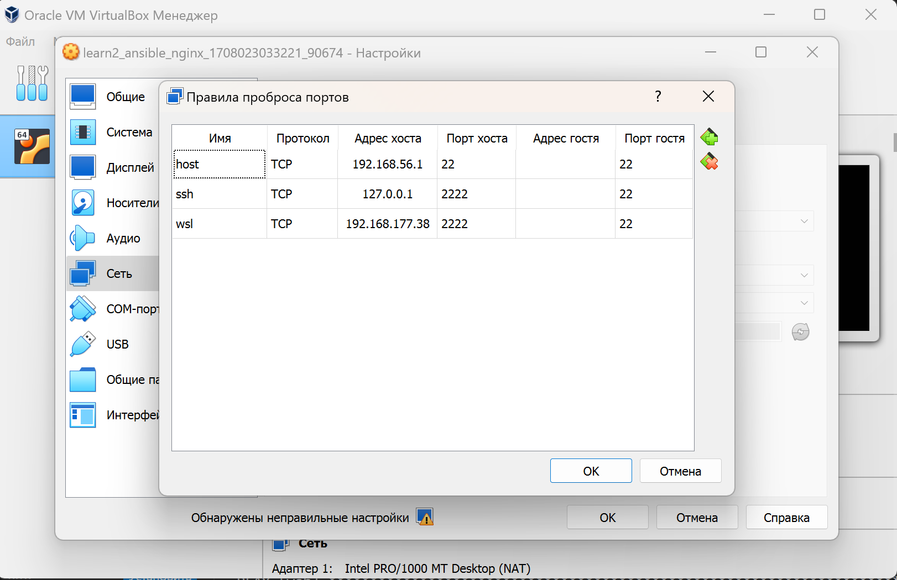

**Выполнялась работа:**

**WSL:** Linux Jarvis 5.15.133.1-microsoft-standard-WSL2 #1 SMP Thu Oct 5 21:02:42 UTC 2023 x86_64 x86_64 x86_64 GNU/Linux


Пробросим дополнительные порты для доступа из WSL по SSH в виртуальный сервер. 
** т.к. эти адреса индивидуальны, настройку провожу через GUI Virtual BOX



Для того, что бы подключаться использовать Ansible на машине WSL(в качестве HOST), скопируем **private_key** в папку /home
Из-за того, что мы работает в windows  файловой системе, как с подмонтированной, а там везде 777, без этого мы не сможем работать с ключем. 

Сразу указываем кастомный путь до **private_key** (/home/privat_key) в **/inventory/vagrant.ini**

**Пример возможной ошибки если этого не сделать:**

```bash
fatal: [nginx]: UNREACHABLE! => {"changed": false, "msg": "Failed to connect to the host via ssh: no such identity: .vagrant/machines/nginx/virtualbox/private_key: No such file or directory\r\nvagrant@192.168.56.1: Permission denied (publickey,password).", "unreachable": true}
```

**wsl:**
```bash
root@Jarvis cd /home/
root@Jarvis:/home# cp  /mnt/c/Users/sveto/OTUS/LinuxProfessional/otus-linux-lp/learn2_ansible/.vagrant/machines/nginx/virtualbox/private_key ./ 
root@Jarvis:/home# chmod 0600 private_key
```

Проверяем, что подключение работает
```bash
root@Jarvis:/home# ssh -i /home/private_key  vagrant@192.168.56.1 -p 22
Last login: Thu Feb 15 20:07:57 2024 from 10.0.2.2
vagrant@nginx:~$
```

** В данном случае в качестве IP  используется адрест хоста машины

Запусук плейбука осуществлялся в формате:

```bash
root@Jarvis:/mnt/c/Users/sveto/OTUS/LinuxProfessional/otus-linux-lp/learn2_ansible/ansible# ansible-playbook deploy.yml -i inventory/vagrant.ini -v
```

**** переменная с портом - в inventory/vagrant.ini**

Проверяем доступность порта, через telnet  и curl 

**telnet:**
```bash
root@nginx:/home/vagrant# telnet localhost 8080
Trying 127.0.0.1...
Connected to localhost.
Escape character is '^]'.
^CConnection closed by foreign host.
```
**curl:**
```bash
root@nginx:/home/vagrant# curl -I localhost:8080
HTTP/1.1 200 OK
Server: nginx/1.18.0 (Ubuntu)
Date: Thu, 15 Feb 2024 22:11:50 GMT
Content-Type: text/html
Content-Length: 612
Last-Modified: Tue, 21 Apr 2020 14:09:01 GMT
Connection: keep-alive
ETag: "5e9efe7d-264"
Accept-Ranges: bytes

```

Если треюуется проверить из вне, то нужно пробросить дополнительный порт. 


